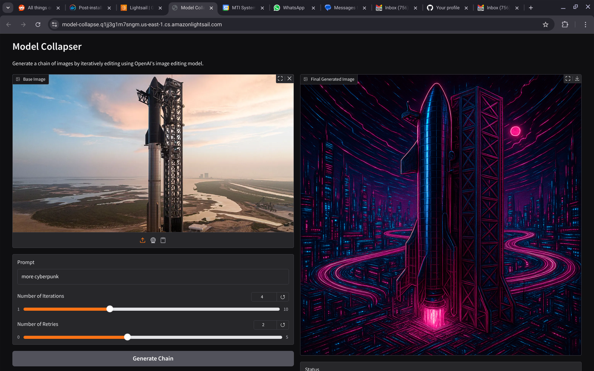

# ModelCollapser

This script uses OpenAI's `gpt-image-1` model to perform iterative image edits: it takes a base image and a text prompt, generates a new image, then uses that output as the next input, repeating for _N_ iterations.  
Usually it leads to model collapse.

## What is Model Collapse?

Model collapse is a phenomenon that occurs when an AI model is repeatedly asked to generate variations of its own outputs. Over multiple iterations, the model tends to:

1. **Lose Diversity**: The model starts producing increasingly similar outputs, eventually converging to a limited set of patterns or styles.
2. **Forget Original Features**: Details from the original image gradually fade away as the model focuses on the most prominent features.
3. **Amplify Biases**: The model's inherent biases become more pronounced with each iteration.
4. **Create Artifacts**: Strange patterns or distortions may emerge as the model struggles to maintain coherence.

This tool demonstrates model collapse by:
- Taking a base image and applying the same prompt repeatedly
- Showing how the image evolves (or devolves) through multiple generations
- Highlighting the limitations of current AI image generation models

The results can be both fascinating and concerning, providing insights into the stability and reliability of AI image generation systems.

---

## 🚀 Features

- **Iterative edits**: produce a chain of variants by feeding each output back as input.
- **Auto-retry**: optional `--retries` flag to automatically retry failed API calls. Useful for when image or prompt is not passing consistently OpenAI filters - this sometimes happen, and image is generated only after some retries.
- **Verbose output**: prints progress and file paths as it runs.
- **Unique output folders**: each run creates a new UUID-named directory to avoid collisions.
- **Gradio Web UI**: run as a web app for easy image uploads and prompt entry.
- **Docker Support**: run the app in a containerized environment.

## 📸 Screenshots



*The Gradio web interface makes it easy to upload images and generate variations.*

---

## 📋 Prerequisites

- Python 3.7+
- OpenAI Python package
- [Optional] Docker (for containerized usage)

Install dependencies:

```bash
pip install -r requirements.txt
```

---

## 🔧 Setup

1. **Clone or download** this repository, and ensure `main.py` and `app.py` are in your working dir.
2. **Set your API key**:

   ```bash
   export OPENAI_API_KEY="YOUR_OPENAI_API_KEY"
   ```

---

## ⚙️ Usage

### Command Line

```bash
python main.py \
  --image <base_image_path> \
  --prompt "Your descriptive prompt here" \
  --n <iterations> \
  [--retries <X>]
```

- `--image` (`-i`): path to your starting image file (PNG/JPG/WebP).
- `--prompt` (`-p`): text prompt guiding the edits.
- `--n` (`-n`): number of iterations (chain length).
- `--retries` (`-r`, optional): automatic retry count on failure. If omitted, script will prompt you interactively.

### Gradio Web App

You can use a web interface for uploading images and entering prompts:

```bash
python app.py
```

- The app will be available at [http://localhost:7860](http://localhost:7860) by default.
- To make it accessible on your network, it binds to `0.0.0.0:7860`.
- Make sure your `OPENAI_API_KEY` is set in your environment.

### Docker

Build and run the app in a container:

```bash
docker build --build-arg OPENAI_API_KEY=your-api-key-here -t modelcollapse .
docker run -p 7860:7860 modelcollapse
```

- The app will be available at [http://localhost:7860](http://localhost:7860)
- The API key is passed securely as a build argument and set as an environment variable in the container.

---

## 🔄 Customization Points

In `main.py`, you can tweak these parameters directly:

| Parameter         | Default         | Description                                                                                      |
|-------------------|-----------------|--------------------------------------------------------------------------------------------------|
| **QUALITY**       | `high`          | Image quality level (`low`, `medium`, `high` or `auto`).                                         |
| **SIZE**          | `1024x1024`     | Output resolution. Options: `1024x1024`, `1536x1024` (landscape), `1024x1536` (portrait), `auto` |
| **RETRIES**       | `None`          | Set default retry count; passing `--retries` overrides this.                                     |

To change, locate the `client.images.edit(...)` call and modify the parameters accordingly.

---

## ⚠️ Notes

- The script expects your `OPENAI_API_KEY` in the environment. No hard-coded keys.
- If an iteration fails and retries are exhausted (or you choose not to retry), the chain stops early and returns whatever was generated up to that point.
- The Gradio app allows for easy testing and demoing in a browser.
- For Docker, always pass your API key securely as shown above.

---

## 📄 License

MIT
